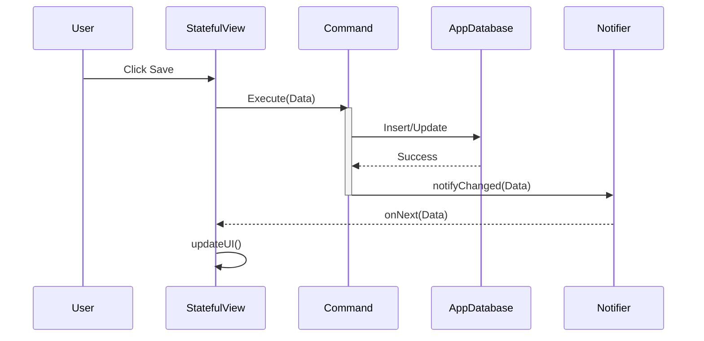
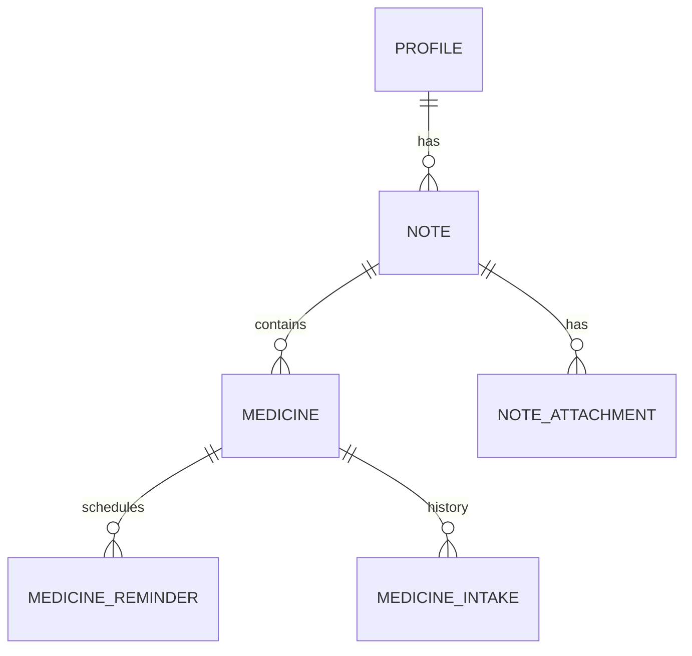

# a-medic-log


A simple and easy to use personal medical notes.
<ul>
  <li>Easily add your medical notes</li>
  <li>Multiple profile to keep track elderly and family members medical history</li>
  <li>Add medicine information and medicine reminder to notify you to take medicine</li>
  <li>Support dark mode and light mode</li>
</ul>

This project is intended for demo app for [a-navigator](https://github.com/rh-id/a-navigator) and [a-provider](https://github.com/rh-id/a-provider) library usage.
The app still works as production even though it is demo app.

## Project Structure

The app uses a-navigator framework as navigator and StatefulView as base structure,
combined with a-provider library for service locator,
and finally RxAndroid to handle UI use cases.

## Architecture

The project is divided into two main modules:
*   `app`: Contains the UI logic, navigation, dependency injection wiring, and business logic implementation.
*   `base`: Contains the Data Layer (Room Entities, DAOs), Repositories, and basic domain models.

### Key Components & Technical Detail

#### 1. Dependency Injection (`a-provider`)
The app utilizes a hierarchical provider structure to manage dependency scopes effectively:
*   **Global Scope (`AppProviderModule`):**
    *   Lifecycle: Bound to `MainApplication`.
    *   Components: `AppDatabase`, `WorkManager`, `Notifiers` (Singleton), `ScheduledExecutorService`.
*   **Activity Scope (`ActivityProvider`):**
    *   Lifecycle: Bound to `MainActivity`. Created via `Provider.createNestedProvider`.
    *   Components: `AppNotificationHandler` (UI-specific logic), `INavigator` (Context-aware).
*   **View Scope (`StatefulViewProvider`):**
    *   Lifecycle: Transient/Pooled.
    *   Usage: Provides dependencies needed strictly for View rendering or local logic.

#### 2. Navigation (`a-navigator`)
*   **Single Activity:** `MainActivity` acts as the container.
*   **StatefulView:** All pages (e.g., `HomePage`, `NotesPage`) extend `StatefulView`.
*   **Configuration:** `NavConfiguration` maps String routes (e.g., `/home`) to `StatefulViewFactory` implementations.
*   **Back Stack:** `Navigator` manages the stack of views. `onBackPressed` is intercepted and delegated to the Navigator.

#### 3. Reactive Lifecycle Management
*   **RxJava3 / RxAndroid:** Used for all asynchronous operations and event handling.
*   **RxDisposer:** A custom helper class that manages `Disposable` objects.
    *   It is provided via DI and linked to the lifecycle of the Provider/Component.
    *   When a `StatefulView` is disposed, its associated Provider (and thus `RxDisposer`) cleans up all active subscriptions, preventing memory leaks.

### Architecture Diagram

```mermaid
graph TD
    subgraph "Base Module"
        DB[(Room Database)]
        DAO[DAOs]
        Entity[Entities]
    end

    subgraph "App Module"
        subgraph "DI Layer"
            AppProv[AppProvider]
            ActProv[ActivityProvider]
            CmdProv[CommandProvider]
        end

        subgraph "UI Layer"
            Act[MainActivity]
            Nav[Navigator]
            View[StatefulView (Page)]
        end

        subgraph "Logic Layer"
            Cmd[Command (Business Logic)]
            Notif[Notifier (Event Bus)]
        end
    end

    AppProv --> ActProv
    Act --> ActProv
    ActProv --> Nav
    Nav --> View
    View -->|Injects| CmdProv
    CmdProv -->|Creates| Cmd
    Cmd -->|Updates| DAO
    DAO -->|Persists| DB
    Cmd -->|Triggers| Notif
    Notif -->|Emits to| View
```

## Workflow & Logic Flow

### 1. Command Execution Pattern (Business Logic)
The app strictly separates UI from Data Logic using the **Command Pattern**.

1.  **UI Action:** User performs an action (e.g., "Save Note").
2.  **Command Creation:** View requests a Command instance (e.g., `UpdateNoteCmd`) from `CommandProvider`.
3.  **Execution:** Command runs on a background thread (`ExecutorService`).
4.  **Persistence:** Command calls `NoteDao` to write to SQLite.
5.  **Notification:** Upon success, Command calls `NoteChangeNotifier`.
6.  **Reaction:** The Notifier emits an event. Active Views listening to this notifier (via `RxDisposer`) update their state.

#### Sequence Diagram



### 2. Domain Model Relationships
The domain follows a strict hierarchy rooted in the **Profile**.

*   **Profile:** Top-level entity. Represents a person.
*   **Note:** Medical entry. **Belongs to** a Profile.
*   **Medicine:** Medication details. **Belongs to** a Note.
*   **MedicineReminder:** Schedule config. **Belongs to** a Medicine.
*   **MedicineIntake:** History log. **Belongs to** a Medicine.

#### Entity Relationship Diagram



## Screenshots


## Support this project
Consider donation to support this project
<table>
  <tr>
    <td><a href="https://trakteer.id/rh-id">https://trakteer.id/rh-id</a></td>
  </tr>
</table>
