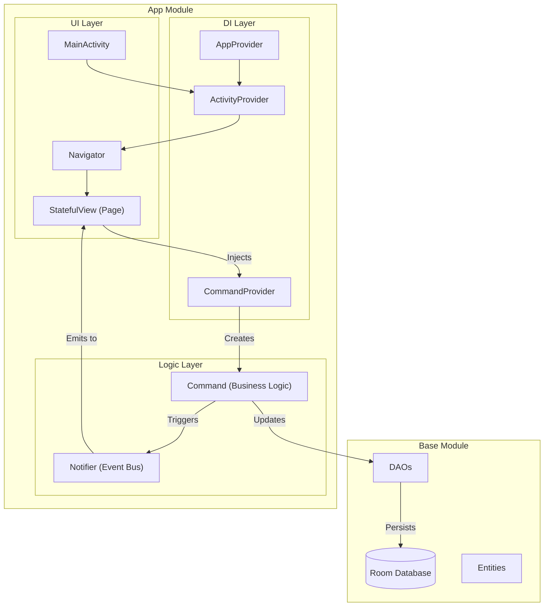
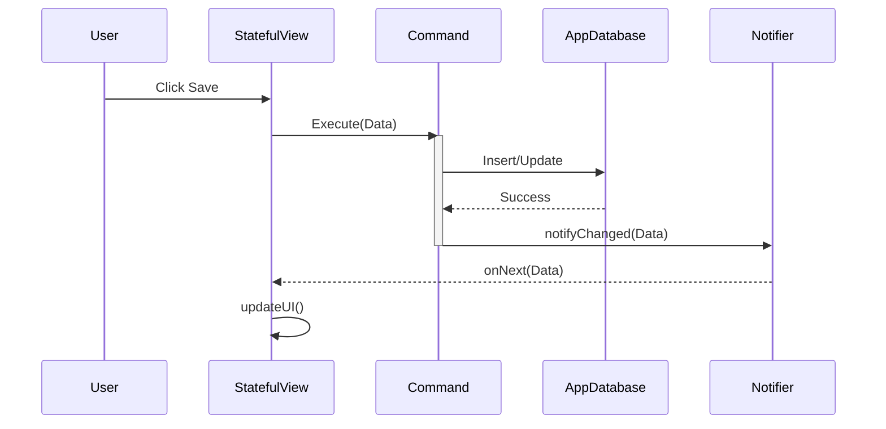
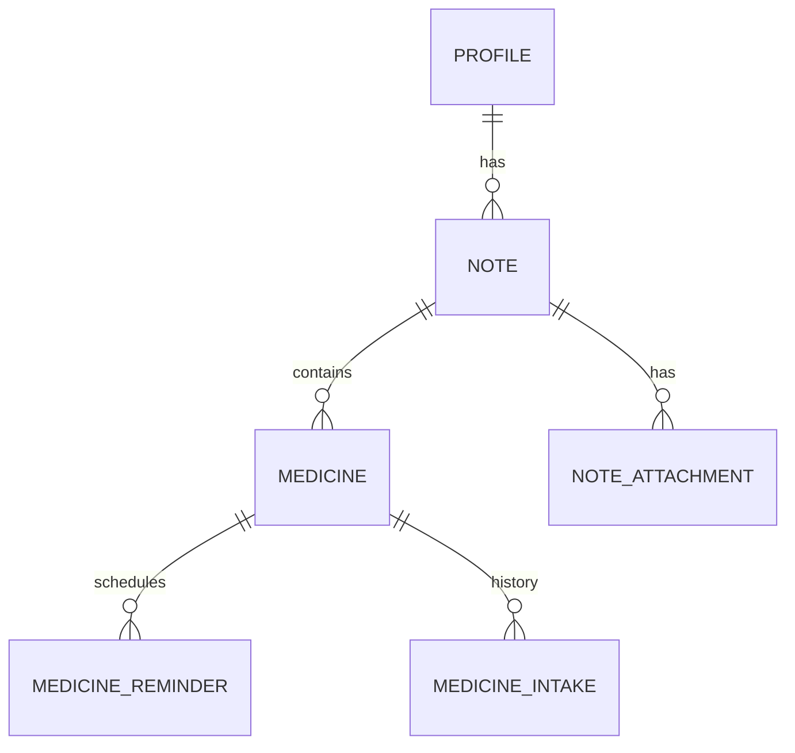

# a-medic-log


A simple and easy to use personal medical notes app.

This project is intended as a demo app for [a-navigator](https://github.com/rh-id/a-navigator) and [a-provider](https://github.com/rh-id/a-provider) library usage.
The app works as a production app even though it is a demo app.

## Features

- **Medical Notes** - Easily add and manage your medical notes with date tracking
- **Multiple Profiles** - Keep track of elderly and family members' medical history
- **Medicine Tracking** - Add medicine information with detailed descriptions
- **Medicine Reminders** - Set up notifications to remind you to take medicine
- **Medicine Intake History** - Log and review past medicine intakes
- **Note Attachments** - Attach files and images to your notes
- **Note Tags** - Tag your notes for better organization
- **Search** - Search through your notes and profiles
- **Dark/Light Mode** - Support for both dark mode and light mode themes
- **Multi-language** - Available in English, German, French, Italian, Indonesian, Estonian, Icelandic, Norwegian (Bokmål & Nynorsk), and Romansh

## Tech Stack

| Component | Detail |
|---|---|
| Language | Java 17 |
| Min SDK | 21 (Android 5.0) |
| Target SDK | 36 (Android 16) |
| Compile SDK | 36 |
| Build System | Gradle (AGP 9.2.1) |
| Architecture | Single-Activity + StatefulView |
| Navigation | [a-navigator](https://github.com/rh-id/a-navigator) |
| Dependency Injection | [a-provider](https://github.com/rh-id/a-provider) |
| Database | Room (SQLite) |
| Reactive | RxJava3 / RxAndroid |
| Background Work | WorkManager |

## Project Structure

The app uses a-navigator framework as navigator and StatefulView as base structure,
combined with a-provider library for service locator,
and finally RxAndroid to handle UI use cases.

The project is divided into two main modules:
*   `app`: Contains the UI logic, navigation, dependency injection wiring, and business logic implementation.
*   `base`: Contains the Data Layer (Room Entities, DAOs), Repositories, and basic domain models.

### Key Components & Technical Detail

#### 1. Dependency Injection (`a-provider`)
The app utilizes a hierarchical provider structure to manage dependency scopes effectively:
*   **Global Scope (`AppProviderModule`):**
    *   Lifecycle: Bound to `MainApplication`.
    *   Components: `AppDatabase`, `WorkManager`, `Notifiers` (Singleton), `ScheduledExecutorService`.
*   **Activity Scope (`ActivityProvider`):**
    *   Lifecycle: Bound to `MainActivity`. Created via `Provider.createNestedProvider`.
    *   Components: `AppNotificationHandler` (UI-specific logic), `INavigator` (Context-aware).
*   **View Scope (`StatefulViewProvider`):**
    *   Lifecycle: Transient/Pooled.
    *   Usage: Provides dependencies needed strictly for View rendering or local logic.

#### 2. Navigation (`a-navigator`)
*   **Single Activity:** `MainActivity` acts as the container.
*   **StatefulView:** All pages (e.g., `HomePage`, `NotesPage`) extend `StatefulView`.
*   **Configuration:** `NavConfiguration` maps String routes (e.g., `/home`) to `StatefulViewFactory` implementations.
*   **Back Stack:** `Navigator` manages the stack of views. `onBackPressed` is intercepted and delegated to the Navigator.

#### 3. Reactive Lifecycle Management
*   **RxJava3 / RxAndroid:** Used for all asynchronous operations and event handling.
*   **RxDisposer:** A custom helper class that manages `Disposable` objects.
    *   It is provided via DI and linked to the lifecycle of the Provider/Component.
    *   When a `StatefulView` is disposed, its associated Provider (and thus `RxDisposer`) cleans up all active subscriptions, preventing memory leaks.

### Architecture Diagram


```mermaid
graph TD
    subgraph "Base Module"
        DB[(Room Database)]
        DAO[DAOs]
        Entity[Entities]
    end

    subgraph "App Module"
        subgraph "DI Layer"
            AppProv[AppProvider]
            ActProv[ActivityProvider]
            CmdProv[CommandProvider]
        end

        subgraph "UI Layer"
            Act[MainActivity]
            Nav[Navigator]
            View["StatefulView (Page)"]
        end

        subgraph "Logic Layer"
            Cmd["Command (Business Logic)"]
            Notif["Notifier (Event Bus)"]
        end
    end

    AppProv --> ActProv
    Act --> ActProv
    ActProv --> Nav
    Nav --> View
    View -->|Injects| CmdProv
    CmdProv -->|Creates| Cmd
    Cmd -->|Updates| DAO
    DAO -->|Persists| DB
    Cmd -->|Triggers| Notif
    Notif -->|Emits to| View
```

## Workflow & Logic Flow

### 1. Command Execution Pattern (Business Logic)
The app strictly separates UI from Data Logic using the **Command Pattern**.

1.  **UI Action:** User performs an action (e.g., "Save Note").
2.  **Command Creation:** View requests a Command instance (e.g., `UpdateNoteCmd`) from `CommandProvider`.
3.  **Execution:** Command runs on a background thread (`ExecutorService`).
4.  **Persistence:** Command calls `NoteDao` to write to SQLite.
5.  **Notification:** Upon success, Command calls `NoteChangeNotifier`.
6.  **Reaction:** The Notifier emits an event. Active Views listening to this notifier (via `RxDisposer`) update their state.

#### Sequence Diagram


```mermaid
sequenceDiagram
    participant User
    participant View as StatefulView
    participant Cmd as Command
    participant DB as AppDatabase
    participant Bus as Notifier

    User->>View: Click Save
    View->>Cmd: Execute(Data)
    activate Cmd
    Cmd->>DB: Insert/Update
    DB-->>Cmd: Success
    Cmd->>Bus: notifyChanged(Data)
    deactivate Cmd
    Bus-->>View: onNext(Data)
    View->>View: updateUI()
```

### 2. Domain Model Relationships
The domain follows a strict hierarchy rooted in the **Profile**.

*   **Profile:** Top-level entity. Represents a person.
*   **Note:** Medical entry. **Belongs to** a Profile.
*   **Medicine:** Medication details. **Belongs to** a Note.
*   **MedicineReminder:** Schedule config. **Belongs to** a Medicine.
*   **MedicineIntake:** History log. **Belongs to** a Medicine.

#### Entity Relationship Diagram


```mermaid
erDiagram
    PROFILE ||--o{ NOTE : has
    NOTE ||--o{ MEDICINE : contains
    NOTE ||--o{ NOTE_ATTACHMENT : has
    MEDICINE ||--o{ MEDICINE_REMINDER : schedules
    MEDICINE ||--o{ MEDICINE_INTAKE : history
```

## Building

### Prerequisites
- JDK 17
- Android SDK with Compile SDK 36

### Build commands
```bash
./gradlew build              # Build debug and release APKs
./gradlew assembleDebug      # Build debug APK only
./gradlew assembleRelease    # Build release APK only
./gradlew test               # Run unit tests
./gradlew connectedCheck     # Run instrumented tests (requires device/emulator)
```

## CI/CD

The project uses GitHub Actions for continuous integration and deployment:

| Workflow | Trigger | Description |
|---|---|---|
| **Android CI** | Push/PR to `master` | Builds the project with Gradle |
| **Emulator Test** | Push/PR to `master` | Runs instrumented tests on API 23 & 29 emulators |
| **Release APKs** | Tag push (`v*`) | Builds signed APKs and creates a GitHub Release with changelog |

## Screenshots


## Support this project
Consider donation to support this project
<table>
  <tr>
    <td><a href="https://trakteer.id/rh-id">https://trakteer.id/rh-id</a></td>
  </tr>
</table>

## License

This project is licensed under the [GNU General Public License v3.0](LICENSE).